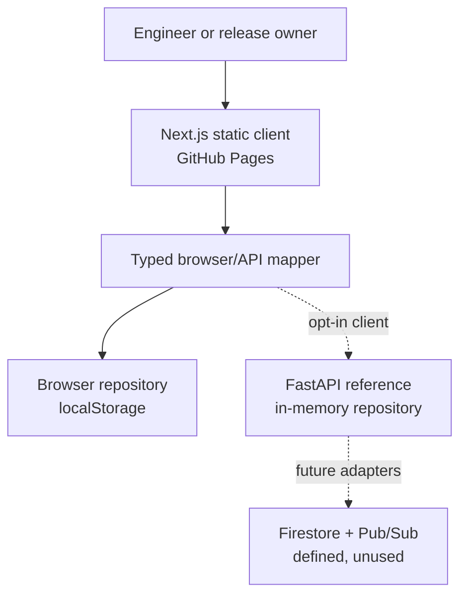

# LaunchProof

**Evidence before release.** LaunchProof turns build, quality, security, accessibility, AI-evaluation, and human-review signals into one explainable release verdict.

[Open the live demo](https://trenn1x.github.io/specforge-analyst-studio/launchproof/) · [View the source](https://github.com/Trenn1x/specforge-analyst-studio/tree/main/projects/launchproof)

> **Deployment truth:** the interactive Next.js frontend is published to GitHub Pages and uses seeded browser-local data. The FastAPI service is tested with a bounded in-memory repository, while the GCP configuration is a reference deployment path. **Neither the API nor any GCP resource is represented as running.**

## What the demo proves

- A release is scored from seven explicit gates rather than a vague green/red status.
- Every gate exposes its source, threshold, result, timestamp, and reason for existing.
- Automated evidence can recommend a verdict, but a human-owned approval can still block deployment.
- Users can switch candidates, filter gates, inspect evidence, rerun an assessment, request changes, approve the demo blocker, copy a report, and export the result.
- Changes survive a refresh in `localStorage`; **Reset demo** returns to the deterministic seed state.

The seed data is illustrative. No customer data, credentials, or live service calls are included in the public bundle.

## Capability evidence

This repository answers seven common engineering-hiring questions with inspectable work instead of inflated claims.

| Area | Evidence in this repository |
| --- | --- |
| Next.js, React, and TypeScript | Next.js 16.3.4 App Router, React 19.2, strict TypeScript, static export, typed domain models, client state, persistence, and accessible interactions. |
| End-to-end product ownership | Product framing, interaction design, scoring policy, implementation, tests, architecture, security boundaries, deployment configuration, and operations guidance live together. |
| Depth of software-engineering practice | Deterministic business logic, failure modes, tests, API contracts, a container boundary, infrastructure as code, and a runbook are visible. The project demonstrates current ability; it does not relabel earlier automation work as additional software-development tenure. |
| Team delivery | CI, contribution rules, pull-request expectations, review ownership, ADRs, threat modeling, release gates, and rollback criteria make collaboration concrete. |
| Technical direction | Scope is split into reversible slices, tradeoffs are recorded, ownership is explicit, and reviewers receive a repeatable decision framework. |
| Cloud and GCP path | A containerized, tested FastAPI reference plus private Cloud Run, least-privilege IAM, OIDC, and Terraform show the deployment boundary. Firestore and Pub/Sub are provisioned placeholders for future adapters, not active dependencies. No cloud resource is claimed as deployed. |
| AI-assisted development | AI may help generate options and repetitive code; humans retain architecture, security, acceptance, and merge authority. Accepted output must pass the same tests and review as human-written work. |

## Architecture



The solid path is the live browser-only demonstration: Pages instantiates `BrowserReleaseRepository`. `ReleaseDataSource` and `ReleaseRepository` define the frontend boundary, while the opt-in `FastApiReleaseClient` maps snake_case DTOs into the camel-cased domain model. The dotted paths show that tested API option and the future durable/async adapters. A failed API call stays an error; it does not silently fall back to demo state.

The release score is a weighted average of gate states. `passed`, `warning`, `blocked`, and `pending` contribute `1.0`, `0.68`, `0.20`, and `0.40` of a gate's weight. A blocker or pending gate prevents a `Ready` verdict regardless of an otherwise healthy score. See [Architecture](docs/architecture.md) for the data flow and failure behavior.

## Repository map

```text
app/                 Next.js routes and product narrative
components/          Interactive release console
lib/                 Typed model, browser/API mapping, seed data, and deterministic policy
services/api/        FastAPI reference service and tests
infra/terraform/     GCP reference infrastructure
docs/                Architecture, assurance, operations, and ADRs
.github/              CI, Pages deployment, and review conventions
```

## Run the frontend

Requirements: Node.js 22.12 or newer. CI uses the current Node 22 release selected by `.nvmrc`.

```bash
npm ci
npm run dev
```

Open `http://localhost:3000`.

Run the complete frontend quality gate:

```bash
npm run verify
```

That command runs ESLint, TypeScript, unit tests, and the production static export. The export is written to `out/`.

## Run the API locally

Requirements: Python 3.11 or newer.

```bash
python -m venv .venv
source .venv/bin/activate
python -m pip install -r services/api/requirements-dev.txt
python -m uvicorn app.main:app --app-dir services/api --reload --port 8080
```

Then open `http://localhost:8080/docs` or check `http://localhost:8080/health/live`.

Run its quality gate from the repository root:

```bash
(
  cd services/api
  python -m ruff check .
  python -m pytest
)
```

The current API uses deterministic seed data and a thread-safe, bounded in-memory repository. It requires expected-commit and idempotency controls on mutations, rejects materially future evidence, and turns stale non-blocking evidence into `pending`. State and idempotency history still reset with the process. Its repository boundary reserves a future Firestore implementation, but no durable adapter or storage switch exists in this release. A local run does not create GCP resources.

## Deployment paths

### Public demo

The verified static export is published at `/launchproof/` inside the Pages-enabled SpecForge portfolio repository. Its root-level `launchproof-ci.yml` workflow runs this source tree's web, API, and Terraform quality gates. `.github/workflows/pages.yml` is the standalone Pages deployment path retained for migration into a dedicated repository. Neither path receives runtime secrets because every shipped asset is public by definition.

### GCP reference path

`infra/terraform/` describes Cloud Run, Firestore, Pub/Sub, Artifact Registry, service identity, and supporting APIs. The current API remains in-memory and does not read Firestore or publish to Pub/Sub. Terraform caps the reference Cloud Run service at one instance so a test deployment cannot split process-local histories; that is a constraint, not durable storage.

Bootstrap order is deliberate: a reviewed `terraform apply` creates the private Cloud Run service with a public hello image, then the manual deployment workflow verifies that service exists and updates its image to the tested LaunchProof digest. Terraform owns service configuration; the workflow owns application revisions, and Terraform ignores only later image changes so it does not roll a deployed revision backward.

Applying this design requires an explicit project, review of the plan, and separately configured identity federation. None of those resources are claimed as deployed here. See the [runbook](docs/runbook.md) before any apply or workflow run.

## Engineering notes

- [Architecture](docs/architecture.md)
- [AI assurance](docs/ai-assurance.md)
- [Threat model](docs/threat-model.md)
- [Operations runbook](docs/runbook.md)
- [Delivery plan](docs/delivery-plan.md)
- [ADR 0001: static demo and API reference](docs/adr/0001-static-pages-production-api.md)
- [ADR 0002: human approval remains authoritative](docs/adr/0002-human-approval.md)
- [ADR 0003: separate evidence from verdicts](docs/adr/0003-evidence-verdict-separation.md)
- [Contributing](CONTRIBUTING.md)
- [Security policy](SECURITY.md)

## License

MIT. See [LICENSE](LICENSE).
