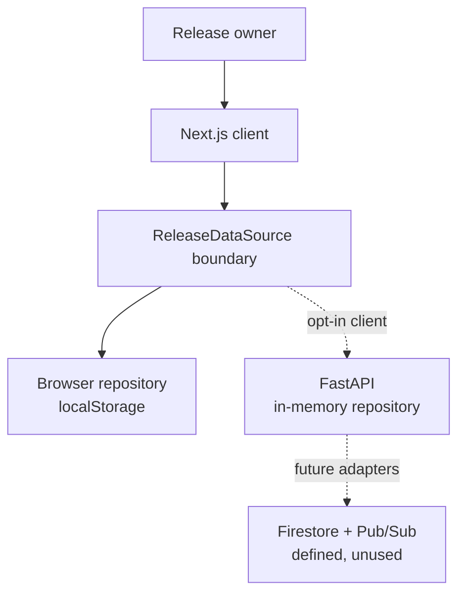
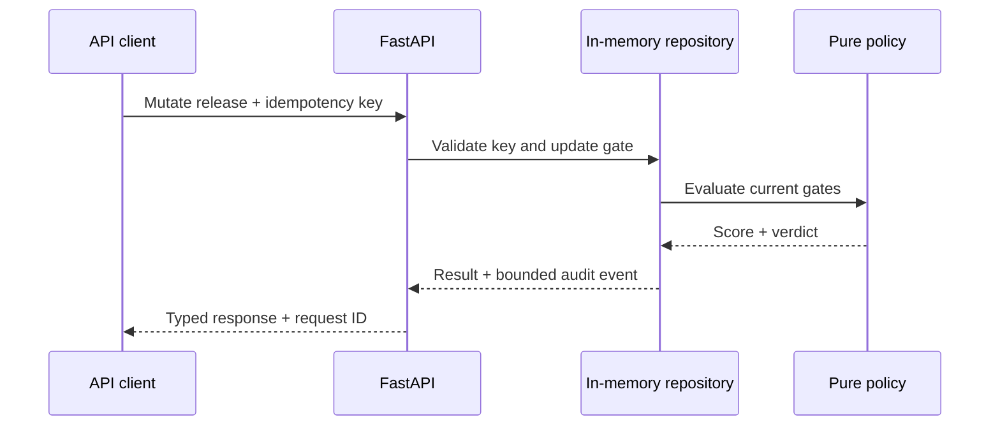

# Architecture

## Purpose

LaunchProof turns release-gate observations into an explainable recommendation while keeping three concerns separate: **what was observed** (evidence), **what policy concludes** (verdict), and **who accepts release risk** (human decision).

## Deployment and implementation truth

| Mode | Current status | State | Intended use |
| --- | --- | --- | --- |
| Static client | Live on GitHub Pages | Seeded releases plus browser `localStorage` | Public, inspectable product demonstration |
| FastAPI service | Implemented and tested; not hosted | Thread-safe, bounded, process-local repository | Exercise HTTP contracts, validation, scoring, idempotency, and audit-style history |
| GCP reference path | Terraform and manual workflow defined; not applied | Private Cloud Run target capped at one instance; Firestore and Pub/Sub resources reserved but unused | A controlled staging path and a base for future durable adapters |

Only the first mode is represented as live. The API loses state and idempotency history on restart. The one-instance Cloud Run cap prevents divergent process-local copies; it does not make that state durable or production-ready.

## System context

The Pages build follows the solid path by instantiating `BrowserReleaseRepository`. The opt-in `FastApiReleaseClient` follows the dotted API path. Selecting it must fail visibly when the API is unavailable; it must not silently convert a failed server operation into browser-only state.

## Implemented components

### Next.js client

- App Router pages present the release console, architecture, and delivery standard.
- Typed React state supports candidate selection, evidence filtering, audit inspection, decisions, report copying, and JSON export.
- The browser repository persists the demonstration in `localStorage`; **Reset demo** restores deterministic seed data.
- Static export keeps the public deployment inexpensive and secret-free.
- Browser data is user-controlled, per-device, and never an authoritative approval record.

### Typed repository and mapping boundary

`ReleaseDataSource` defines loading, while `ReleaseRepository` adds browser persistence operations. `BrowserReleaseRepository` implements the latter for Pages. `FastApiReleaseClient` is an explicit remote data source; `mapFastApiReleaseCandidate` converts stored evidence fields such as `source_version`, `commit`, and `observed_at`, while `mapAutomatedAssessmentCommand` converts `expectedCommit`, gate updates, and nested evidence receipts to the API's snake_case contract. Non-success HTTP responses become `FastApiClientError`, with no demo fallback.

These TypeScript DTOs provide compile-time structure; the client does not yet runtime-validate a successful remote JSON body. That validation is required before enabling the remote client for production traffic. The mapping code is contract evidence, not evidence that the API is deployed.

### Deterministic policy

Each gate has a weight and one of four states:

| State | Weight multiplier | Meaning |
| --- | ---: | --- |
| `passed` | 1.00 | Threshold satisfied |
| `warning` | 0.68 | Degraded but potentially acceptable |
| `pending` | 0.40 | Required signal absent or incomplete |
| `blocked` | 0.20 | Explicit release stop |

The score is the rounded weighted average. A score of at least 92 with no blocked or pending gate is `Ready`. A blocker below 78 is `Hold`; other incomplete or sub-threshold states are `Conditional`. Equivalent pure policies are unit-tested in TypeScript and Python.

### FastAPI service

The service implements liveness/readiness, release list/detail, audit-history reads, automated assessment updates, and human-decision updates. It includes:

- strict Pydantic request/response models that reject unknown fields;
- a 256 KiB request-body limit and explicit CORS allowlist;
- request IDs, structured completion logs, and safe error envelopes;
- required idempotency keys for mutations, including conflict detection;
- expected-commit binding, timezone-aware evidence timestamps, and a 24-hour freshness rule;
- a thread-safe in-memory repository with bounded audit and idempotency histories;
- tests for policy, repository behavior, endpoints, validation, limits, and replay.

The service does **not** implement durable storage or end-user authentication. It accepts reviewer identity fields as data, not verified identity. Terraform would keep Cloud Run invocation private, but an authenticated product client and resource-level authorization are still required before production use.

## Defined future components

### Firestore adapter

Terraform defines a protected Firestore database, but the current API never reads or writes it. A future repository implementation can provide durable releases, evidence, decisions, and audit events behind the existing service boundary. That future store should make evidence snapshots immutable and audit history append-only; those properties do not describe the current bounded in-memory lists.

### Pub/Sub ingestion

Terraform defines a Pub/Sub topic, but the current API neither publishes nor consumes messages. Future evidence workers may use it for asynchronous checks once message authentication, correlation, idempotency, retry, and dead-letter behavior are implemented and tested.

## Core model

- **Release candidate:** product, version, commit, branch, environment, owner, risk, and gates.
- **Gate:** policy identifier, weight, status, summary, automation ownership, and evidence.
- **Evidence item:** source, observed value, threshold, timestamp, and explanation.
- **Assessment:** score, verdict, and gate counts for the current input state.
- **Decision:** claimed reviewer, role, approval or change request, note, and timestamp.
- **Audit event:** an append-style entry in a bounded browser or process-local history.

In a future durable implementation, evidence and assessments should be version-linked to an immutable release artifact so a later policy change cannot rewrite why an earlier decision was made.

## Current API request flow

The API caller currently supplies normalized gate updates and evidence receipts. The repository binds mutations and receipts to the expected release commit, rejects timestamps more than five minutes in the future, and changes stale non-blocking evidence to `pending` after 24 hours. It does not retrieve external evidence or authenticate the claimed source. Source identity remains work for a future ingestion boundary.

## Failure behavior

- **API unavailable:** an API-configured frontend reports failure; it does not silently write the decision to demo storage.
- **Process restart:** releases, recent events, and idempotency keys reset to seed state.
- **Multiple instances:** unsupported for the current repository, which is why reference Terraform caps Cloud Run at one.
- **Invalid or oversized input:** the API returns a structured 4xx response and request ID.
- **Duplicate mutation:** the same scoped key and payload replays the original result; reuse with different input returns a conflict.
- **Stale or future evidence:** non-blocking evidence older than 24 hours becomes `pending`; materially future evidence is rejected; a blocking result remains blocking.

## Security boundaries

1. The public static bundle is untrusted, user-modifiable, and contains no credentials.
2. Strict HTTP models and size limits protect the implemented API boundary, but they are not authorization.
3. The Terraform target keeps Cloud Run private and gives GitHub short-lived OIDC credentials; no GCP resource is currently claimed as deployed.
4. End-user authentication, role enforcement, a durable repository, and trusted evidence ingestion remain launch blockers.
5. Protected deployment approval remains separate from the application's automated recommendation.

See [the threat model](threat-model.md), [ADR 0002](adr/0002-human-approval.md), and [ADR 0003](adr/0003-evidence-verdict-separation.md).

## Deployment ownership

GitHub Actions builds the Next.js static export for Pages. For the reference GCP path, Terraform owns service configuration and creates a private, one-instance Cloud Run service with a bootstrap image. A protected manual workflow verifies that service exists, tests and builds the API, resolves an immutable image digest, and updates only the application image. Firestore and Pub/Sub stay unused until their adapters exist.

No cloud apply should occur from an unreviewed pull request. Prerequisites and rollback are in [the runbook](runbook.md).
