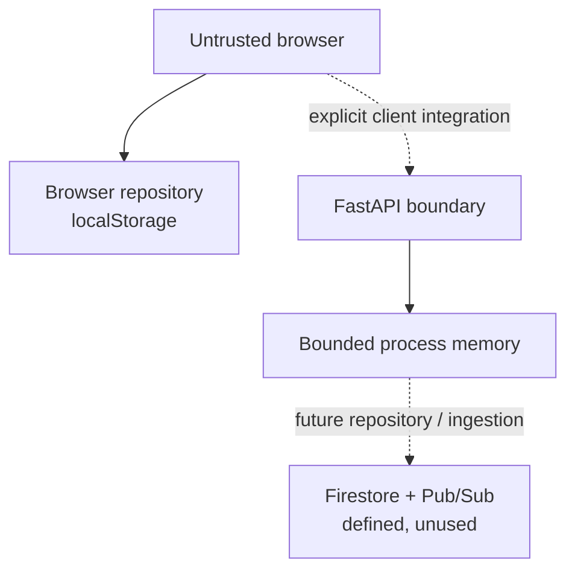

# Threat model

## Scope and deployment truth

This model distinguishes three things:

- the live GitHub Pages demo, which uses synthetic browser-local data;
- the implemented FastAPI reference, which is tested but not hosted and stores state only in its process;
- a Terraform-defined GCP path, which has not been applied and includes Firestore/Pub/Sub resources the current API does not use.

The API has no end-user authentication or resource-level authorization. Reviewer names and roles are request data, not verified identities. Those are explicit production blockers.

## Assets

- integrity of the scoring policy and displayed release state;
- availability and correctness of API contracts and mutations;
- process-local idempotency and recent audit-style history;
- deployment identity, workflow configuration, and image provenance;
- future confidentiality, durability, provenance, and authorization guarantees.

## Actors

- anonymous visitor controlling their own browser state;
- API caller able to reach a local or future private service;
- repository contributor and workflow approver;
- future release owner, reviewer, and evidence producer;
- compromised account, workflow, dependency, or client.

## Current and future boundaries

Everything in the public frontend can be read or changed by its user. The FastAPI boundary validates structure and size, but it does not establish user identity. Terraform would make Cloud Run private to IAM-authenticated callers; it does not provide product roles by itself.

## Threats and current status

| Threat | Impact | Implemented control or limitation | Required next control |
| --- | --- | --- | --- |
| Browser-state tampering | Altered demo score or approval | Browser state is labeled synthetic, local, and non-authoritative | Never accept browser state as a server decision |
| API contract mismatch | Incorrect UI state | Central snake_case DTO mapping, typed domain conversion, and explicit non-2xx errors | Add runtime validation for remote JSON before production use |
| Spoofed reviewer | Unauthorized decision | No end-user identity exists; reviewer fields are unverified | Authenticate callers and enforce role/resource authorization server-side |
| Automated write to human gate | Automation bypasses review | Assessment mutations reject gates marked non-automated | Bind the separate decision route to a verified reviewer role |
| Evidence tampering or replay | False recommendation | Strict schema, expected-commit binding, timezone checks, 24-hour freshness, and scoped idempotency | Authenticate evidence sources and persist provenance/idempotency durably |
| Duplicate mutation | Repeated or conflicting update | Same per-process key/payload replays; changed payload returns conflict | Persist idempotency records before multi-instance operation |
| Process restart | Lost changes, history, and idempotency | Limitation is explicit; Terraform caps the reference service at one instance | Implement and test a durable repository |
| Malformed or oversized request | Crash or resource pressure | Unknown fields are rejected; body limit is 256 KiB; errors include request IDs | Add rate controls and environment-level abuse monitoring |
| CORS mistaken for authorization | Unauthorized caller | Documentation states CORS is not authorization; Cloud Run target is private | Add authenticated product client and deny-by-default authorization |
| Secret in static bundle | Credential disclosure | Pages uses the browser repository and receives no runtime secret | Keep deployment identity server/workflow-side and add secret scanning |
| Stored/reflected script content | Browser compromise | React escapes rendered strings; API strings are length-bounded | Add runtime content policy before any rich-text rendering |
| Sensitive logging | Data disclosure | Request log allowlists method, path, status, duration, and request ID; bodies are not logged | Define retention and audit access in a real environment |
| Supply-chain compromise | Malicious build or runtime | Lockfiles, exact direct pins, Dependabot, CI verification, and digest deployment path | Add artifact attestation and container/dependency scanning |
| Audit rewrite or deletion | Lost accountability | Current history is bounded and process-local; it has no tamper-resistance claim | Future durable store must use append-only authorization and backup/export controls |

## Implemented abuse cases

Tests cover same-key replay, conflicting-key reuse, invalid fields, missing idempotency keys, oversized bodies, request IDs, unknown releases, expected-commit conflicts, stale/future evidence, and attempts to update the human gate through the automated assessment route.

## Future abuse cases

- A user who can view release A attempts to approve release B.
- A future ingestion worker redelivers after its first durable write.
- Durable storage fails between policy calculation and decision/audit persistence.
- A future external evaluator returns injected instructions or fields outside its schema.

These are requirements for future adapters, not claims about code already present.

## Security gates before a real API deployment

- choose and test end-user authentication and a resource/role authorization matrix;
- replace the in-memory repository or accept strictly temporary, single-instance staging behavior;
- authenticate evidence sources and make freshness policy environment-aware;
- add runtime validation of remote JSON at the frontend boundary;
- configure rate limits, security headers, alert ownership, retention, and budget thresholds;
- enable dependency, container, secret, and infrastructure scans;
- exercise idempotency, restart, rollback, and identity-compromise playbooks.

## Review triggers

Revisit this model when adding durable storage, messaging, an external evaluator, a new data class, a mutable endpoint, end-user identity, a deployment target, or an authorization role—and after any relevant incident.
